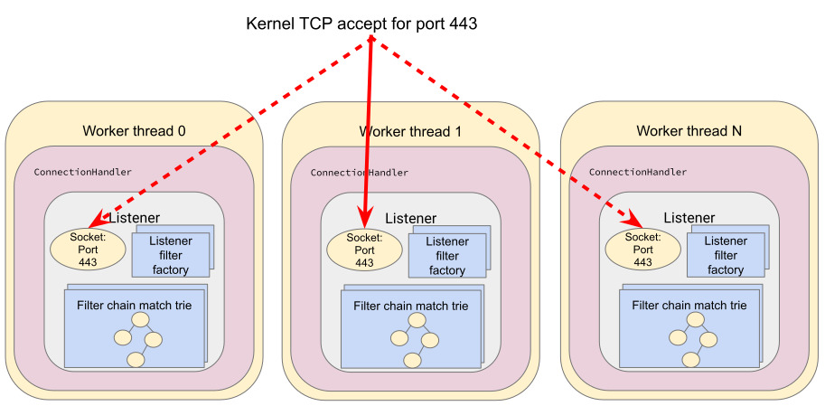
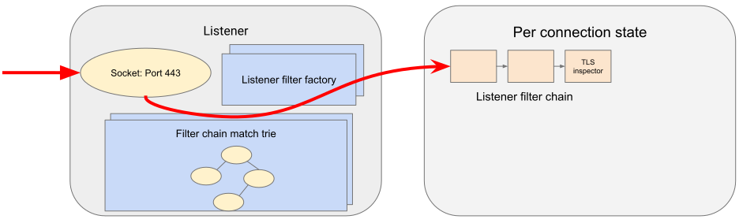
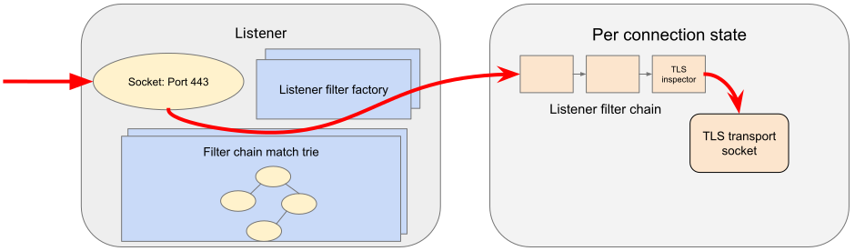
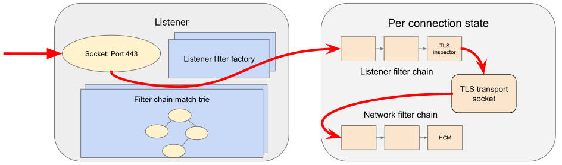
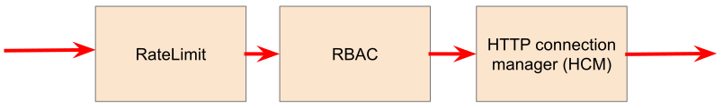
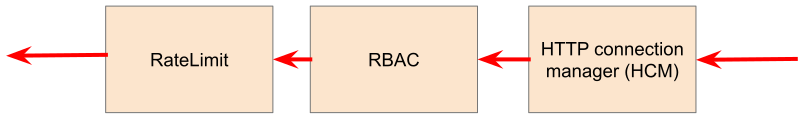
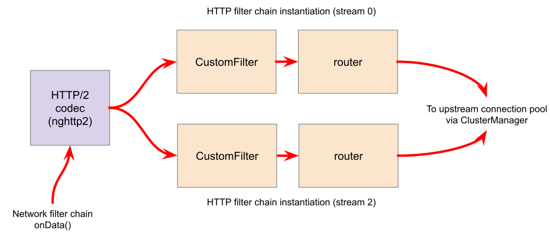
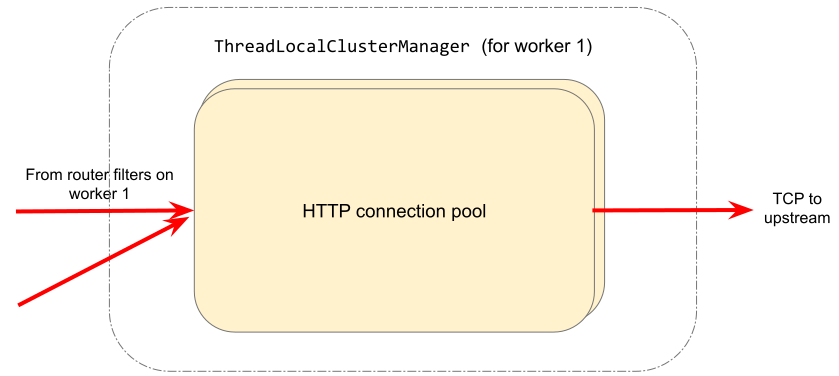

# 请求的生命周期

下面我们描述通过 Envoy 代理的请求生命周期中的事件。我们首先描述 Envoy 如何适应请求的请求路径，然后描述请求从下游到达 Envoy 代理后发生的内部事件。我们跟随请求直到相应的上游分派和响应路径。

## 术语

- Downstream: 连接到 Envoy 的实体。这可能是本地应用程序（在边车模型中）或网络节点。在非 Sidecar 模型中，这是一个远程客户端。
- Upstream: Envoy 在转发服务请求时连接到的端点（网络节点）。这可能是本地应用程序（在边车模型中）或网络节点。在非 Sidecar 模型中，这对应于远程后端
- Listeners：Envoy 模块负责绑定到 IP/端口，接受新的 TCP 连接（或 UDP 数据报）并编排请求处理的面向下游的方面。
- Filter: Envoy 模块负责绑定到 IP/端口，接受新的 TCP 连接（或 UDP 数据报）并编排请求处理的面向下游的方面。
- Filter chain: 一系列过滤器。
- Cluster: 具有一组端点的逻辑服务，Envoy 将请求转发到这些端点。
- Endpoints: 实现逻辑服务的网络节点。它们被分组到集群中。集群中的端点位于Envoy 代理的上游。

## 高层架构

Envoy 中的请求处理路径有两个主要部分：

- 处理下游请求处理的侦听器子系统(ListenerManager)。它还负责管理下游请求生命周期和客户端的响应路径。
- 负责选择和配置到端点的上游连接的集群子系统(ClusterManager)。这是集群和端点健康状况、负载平衡和连接池的知识所在。

这两个子系统与 HTTP 路由器过滤器桥接，它将 HTTP 请求从下游转发到上游。


Envoy 有一个基于事件的线程模型。主线程负责服务器生命周期、配置处理、统计等，一些工作线程处理请求。所有线程都围绕事件循环 ( libevent ) 运行，并且任何给定的下游 TCP 连接（包括其上的所有多路复用流）在其生命周期内都将由一个工作线程处理。每个工作线程维护自己的到上游端点的 TCP 连接池。

## 请求流程

示例：
```yaml
static_resources:
  listeners:
  # There is a single listener bound to port 443.
  - name: listener_https
    address:
      socket_address:
        protocol: TCP
        address: 0.0.0.0
        port_value: 443
    # A single listener filter exists for TLS inspector.
    listener_filters:
    - name: "envoy.filters.listener.tls_inspector"
      typed_config:
        "@type": type.googleapis.com/envoy.extensions.filters.listener.tls_inspector.v3.TlsInspector
    # On the listener, there is a single filter chain that matches SNI for acme.com.
    filter_chains:
    - filter_chain_match:
        # This will match the SNI extracted by the TLS Inspector filter.
        server_names: ["acme.com"]
      # Downstream TLS configuration.
      transport_socket:
        name: envoy.transport_sockets.tls
        typed_config:
          "@type": type.googleapis.com/envoy.extensions.transport_sockets.tls.v3.DownstreamTlsContext
          common_tls_context:
            tls_certificates:
            - certificate_chain: {filename: "certs/servercert.pem"}
              private_key: {filename: "certs/serverkey.pem"}
      filters:
      # The HTTP connection manager is the only network filter.
      - name: envoy.filters.network.http_connection_manager
        typed_config:
          "@type": type.googleapis.com/envoy.extensions.filters.network.http_connection_manager.v3.HttpConnectionManager
          stat_prefix: ingress_http
          use_remote_address: true
          http2_protocol_options:
            max_concurrent_streams: 100
          # File system based access logging.
          access_log:
          - name: envoy.access_loggers.file
            typed_config:
              "@type": type.googleapis.com/envoy.extensions.access_loggers.file.v3.FileAccessLog
              path: "/var/log/envoy/access.log"
          # The route table, mapping /foo to some_service.
          route_config:
            name: local_route
            virtual_hosts:
            - name: local_service
              domains: ["acme.com"]
              routes:
              - match:
                  path: "/foo"
                route:
                  cluster: some_service
          # CustomFilter and the HTTP router filter are the HTTP filter chain.
          http_filters:
          # - name: some.customer.filter
          - name: envoy.filters.http.router
            typed_config:
              "@type": type.googleapis.com/envoy.extensions.filters.http.router.v3.Router
  clusters:
  - name: some_service
    # Upstream TLS configuration.
    transport_socket:
      name: envoy.transport_sockets.tls
      typed_config:
        "@type": type.googleapis.com/envoy.extensions.transport_sockets.tls.v3.UpstreamTlsContext
    load_assignment:
      cluster_name: some_service
      # Static endpoint assignment.
      endpoints:
      - lb_endpoints:
        - endpoint:
            address:
              socket_address:
                address: 10.1.2.10
                port_value: 10002
        - endpoint:
            address:
              socket_address:
                address: 10.1.2.11
                port_value: 10002
    typed_extension_protocol_options:
      envoy.extensions.upstreams.http.v3.HttpProtocolOptions:
        "@type": type.googleapis.com/envoy.extensions.upstreams.http.v3.HttpProtocolOptions
        explicit_http_config:
          http2_protocol_options:
            max_concurrent_streams: 100
  - name: some_statsd_sink
  # The rest of the configuration for statsd sink cluster.
# statsd sink.
stats_sinks:
- name: envoy.stat_sinks.statsd
  typed_config:
    "@type": type.googleapis.com/envoy.config.metrics.v3.StatsdSink
    tcp_cluster_name: some_statsd_sink
```

### 概述

使用上面的示例配置简要概述请求和响应的生命周期：

1.来自下游的 TCP 连接被运行在工作线程上的 Envoy listener 接受。



ListenerManager负责获取表示侦听器的配置并实例化绑定到其各自 IP/端口的多个Listener实例。
Listener可能处于以下三种状态之一：

- Warming：侦听器正在等待配置依赖项（例如路由配置、动态机密）。侦听器尚未准备好接受 TCP 连接。

- Active：侦听器绑定到其 IP/端口并接受 TCP 连接。

- Draining：侦听器不再接受新的 TCP 连接，而允许其现有 TCP 连接在 drain 期间继续。

每个工作线程为每个已配置的侦听器维护自己的侦听器实例。每个侦听器可以通过 SO_REUSEPORT 绑定到同一个端口，或者共享绑定到该端口的单个套接字。当一个新的 TCP 连接到达时，内核决定哪个工作线程将接受该连接，
并且该工作线程的侦听器`Server::ConnectionHandlerImpl::ActiveTcpListener::onAccept()`将调用其回调。

2.创建并运行侦听器过滤器链。它可以提供 SNI 和其他 pre-TLS 信息。一旦完成，侦听器将匹配一个网络过滤器链。每个侦听器可能有多个过滤器链，它们匹配目标 IP CIDR 范围、SNI、ALPN、源端口等的某种组合。一个传输套接字，在我们的例子中是 TLS 传输套接字，与这个过滤器链相关联。

工作线程的监听器然后创建并运行监听器过滤器链。过滤器链是通过应用每个过滤器的过滤器工厂创建的。工厂知道过滤器的配置并为每个连接或流创建一个新的过滤器实例。

在我们的 TLS 侦听器配置的情况下，侦听器过滤器链由TLS 检查器过滤器 ( envoy.filters.listener.tls_inspector) 组成。此过滤器检查初始 TLS 握手并提取服务器名称 (SNI)。然后 SNI 可用于过滤器链匹配。虽然 TLS 检查器显式出现在侦听器过滤器链配置中，但只要侦听器的过滤器链中需要 SNI（或 ALPN），Envoy 也能够自动插入它。




3.在网络读取时，TLS传输套接字将从 TCP 连接读取的数据解密为解密数据流以供进一步处理。

Envoy 通过TransportSocket扩展接口提供可插拔的传输套接字。传输套接字遵循 TCP 连接的生命周期事件并读取/写入网络缓冲区。传输套接字必须实现的一些关键方法是：

```
virtual void onConnected() PURE;
virtual IoResult doRead(Buffer::Instance& buffer) PURE;
virtual IoResult doWrite(Buffer::Instance& buffer, bool end_stream) PURE;
virtual void closeSocket(Network::ConnectionEvent event) PURE;
```

当数据在 TCP 连接上可用时，通过Network::ConnectionImpl::onReadReady()调用TLS传输套接字SslSocket::doRead()。传输套接字然后在 TCP 连接上执行 TLS 握手。握手完成后，SslSocket::doRead()向 的实例提供解密的字节流Network::FilterManagerImpl，负责管理网络过滤器链。



重要的是要注意，无论是 TLS 握手还是过滤器管道的暂停，任何操作都不是真正的阻塞。由于 Envoy 是基于事件的，任何处理需要额外数据的情况都将导致事件提前完成并将 CPU 交给另一个事件。当网络提供更多数据可供读取时，读取事件将触发 TLS 握手的恢复。

4.网络过滤器链已创建并运行。HTTP 最重要的过滤器是 HTTP 连接管理器，它是链中的最后一个网络过滤器。

与侦听器过滤器链一样，Envoy 将通过其过滤器工厂Network::FilterManagerImpl实例化一系列网络过滤器。每个新连接的实例都是新鲜的。网络过滤器，如传输套接字，遵循 TCP 生命周期事件，并在数据从传输套接字可用时被调用。



处理 HTTP 的侦听器的最后一个网络过滤器是HTTP 连接管理器(HCM)。它负责创建 HTTP/2 编解码器和管理 HTTP 过滤器链。在我们的示例中，这是唯一的网络过滤器。使用多个网络过滤器的示例网络过滤器链如下所示：



在响应路径上，网络过滤器链以与请求路径相反的顺序执行。




5.HTTP 连接管理器中的 HTTP/2 编解码器将来自 TLS 连接的解密数据流解帧并解复用为多个独立流。每个流处理单个请求和响应。


6.对于每个 HTTP 流，都会创建并运行一个HTTP 过滤器链。请求首先通过 CustomFilter，CustomFilter 可以读取和修改请求。
最重要的 HTTP 过滤器是位于 HTTP 过滤器链末端的路由器过滤器。
当decodeHeaders在路由器过滤器上调用时，将选择路由并选择一个集群。
流上的请求标头被转发到该集群中的上游端点。路由器过滤器从集群管理器为匹配的集群获取一个 HTTP 连接池来执行此操作。



7.执行特定于集群的负载平衡以查找端点。检查集群的断路器以确定是否允许新流。如果端点的连接池为空或容量不足，则会创建到端点的新连接。

每个集群都有一个负载均衡器，它在新请求到达时选择一个端点。Envoy 支持多种负载均衡算法，例如weighted round-robin、Maglev、least-loaded、random。
负载均衡器通过静态引导配置、DNS、动态 xDS（CDS 和 EDS 发现服务）和主动/被动健康检查的组合获得有效分配。

选择端点后，该端点的连接池将用于查找转发请求的连接。如果不存在到主机的连接，或者所有连接都达到其最大并发流限制，
则会建立一个新连接并将其放入连接池中，除非集群的最大连接数断路器已触发。如果配置并达到连接的最大生命周期流限制，
则会在池中分配一个新连接并耗尽受影响的 HTTP/2 连接。还检查其他断路器，例如对集群的最大并发请求。有关详细信息，请参阅断路器和连接池。




8.上游端点连接的 HTTP/2 编解码器将请求的流与通过单个 TCP 连接传输到该上游的任何其他流进行多路复用和组帧。

9.上游端点连接的 TLS 传输套接字加密这些字节并将它们写入上游连接的 TCP 套接字。

10.由标头、可选主体和尾部组成的请求在上游代理，响应在下游代理。响应以与请求相反的顺序通过 HTTP 过滤器，从路由器过滤器开始，通过 CustomFilter，然后发送到下游。

11.响应完成后，流将被销毁。请求后处理将更新统计信息，写入访问日志并完成跟踪跨度。


