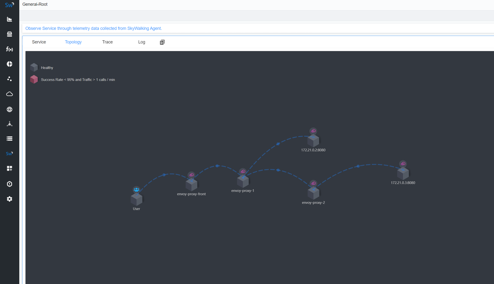

# Skywalking tracing

Skywalking 跟踪沙箱使用Skywalking作为跟踪提供程序演示了 Envoy 的请求跟踪功能。

在本例中，提供了 2 个后端服务：
- service-1
- service-2

还提供了 3 个 Envoy 代理来将请求路由到它们：
- envoy-front-proxy( envoy-front-proxy.yaml)
- envoy-1( envoy-1.yaml)
- envoy-2( envoy-2.yaml)

对于service-1，请求根据请求路径进行路由trace/1，如下：

用户 -> Envoy( envoy-front-proxy) -> Envoy( envoy-1) ->service-1

对于service-2，请求根据请求路径进行路由，trace/2如下所示：

用户 -> Envoy( envoy-front-proxy) -> Envoy( envoy-1) -> Envoy( envoy-2) ->service-2

所有 Envoy 代理都被配置为收集请求跟踪，从它们的配置中可以看出，将 Skywalking 跟踪器生成的跨度传播到 Skywalking OAP 集群。

**只有 envoy-front-proxy 暴露了外部端口 10000**，所以只能通过 envoy-front-proxy 打入流量，这是本案例能正常进行的基础。

如下是 docker-compose的配置：

```
services:

  envoy-front-proxy:
    build:
      dockerfile: ../shared/envoy/Dockerfile
      args:
        ENVOY_CONFIG: envoy-front-proxy.yaml
    depends_on:
      skywalking-ui:
        condition: service_healthy
      envoy-1:
        condition: service_started
      envoy-2:
        condition: service_started
    ports:
    - "${PORT_PROXY:-10000}:10000"

  envoy-1:
    build:
      dockerfile: ../shared/envoy/Dockerfile
      args:
        ENVOY_CONFIG: envoy-1.yaml
    depends_on:
      skywalking-ui:
        condition: service_healthy
      service-1:
        condition: service_healthy
      envoy-2:
        condition: service_started

  envoy-2:
    build:
      dockerfile: ../shared/envoy/Dockerfile
      args:
        ENVOY_CONFIG: envoy-2.yaml
    depends_on:
      skywalking-ui:
        condition: service_healthy
      service-2:
        condition: service_healthy
```

## 第 1 步：构建沙箱

```sh
$ pwd
/root/envoy/examples/skywalking

$ docker-compose pull
$ docker-compose up --build -d

Use 'docker scan' to run Snyk tests against images to find vulnerabilities and learn how to fix them
[+] Running 9/9
 ⠿ Network skywalking_default                Created                                                                                                                                       0.1s
 ⠿ Container skywalking-elasticsearch-1      Started                                                                                                                                       1.6s
 ⠿ Container skywalking-service-1-1          Started                                                                                                                                       1.6s
 ⠿ Container skywalking-service-2-1          Started                                                                                                                                       1.6s
 ⠿ Container skywalking-skywalking-oap-1     Started                                                                                                                                      33.2s
 ⠿ Container skywalking-skywalking-ui-1      Started                                                                                                                                     109.2s
 ⠿ Container skywalking-envoy-2-1            Started                                                                                                                                     120.8s
 ⠿ Container skywalking-envoy-1-1            Started                                                                                                                                     122.0s
 ⠿ Container skywalking-envoy-front-proxy-1  Started  

$ docker-compose ps

NAME                             COMMAND                  SERVICE             STATUS              PORTS
skywalking-elasticsearch-1       "/bin/tini -- /usr/l…"   elasticsearch       running (healthy)   9300/tcp
skywalking-envoy-1-1             "/docker-entrypoint.…"   envoy-1             running             10000/tcp
skywalking-envoy-2-1             "/docker-entrypoint.…"   envoy-2             running             10000/tcp
skywalking-envoy-front-proxy-1   "/docker-entrypoint.…"   envoy-front-proxy   running             0.0.0.0:10000->10000/tcp, :::10000->10000/tcp
skywalking-service-1-1           "python3 /code/servi…"   service-1           running (healthy)   
skywalking-service-2-1           "python3 /code/servi…"   service-2           running (healthy)   
skywalking-skywalking-oap-1      "bash docker-entrypo…"   skywalking-oap      running (healthy)   12800/tcp
skywalking-skywalking-ui-1       "bash docker-entrypo…"   skywalking-ui       running (healthy)   0.0.0.0:8080->8080/tcp, :::8080->8080/tcp
```

## 第2步：发送请求

访问 service1

```sh
$ curl http://localhost:10000/trace/1
Hello from behind Envoy (service 1)!

$ curl http://localhost:10000/trace/1
Hello from behind Envoy (service 1)!

$ curl http://localhost:10000/trace/1
Hello from behind Envoy (service 1)!

$ curl http://localhost:10000/trace/1
Hello from behind Envoy (service 1)!
```

访问 service2

```sh
$ curl http://localhost:10000/trace/2
Hello from behind Envoy (service 2)!

$ curl http://localhost:10000/trace/2
Hello from behind Envoy (service 2)!

$ curl http://localhost:10000/trace/2
Hello from behind Envoy (service 2)!

$ curl http://localhost:10000/trace/2
Hello from behind Envoy (service 2)!
```

## 第3步：在 Skywalking UI 中查看tracing

将浏览器指向http://localhost:8080。

将会看到 Skywalking 仪表板。



## 分析envoy配置文件

### envoy-front-proxy

```yaml
# This proxy listens on port 10000, and routes the following paths:
#
#   /trace/1 -> routes to `envoy-1` on port 10000
#   /trace/2 -> routes to `envoy-1` on port 10001 (for onward routing to `envoy-2`)

# The `client_config` setting below is used by Skywalking to identify the proxy.

static_resources:
  listeners:
  - address:
      socket_address:
        address: 0.0.0.0
        port_value: 10000
    traffic_direction: OUTBOUND
    filter_chains:
    - filters:
      - name: envoy.filters.network.http_connection_manager
        typed_config:
          "@type": type.googleapis.com/envoy.extensions.filters.network.http_connection_manager.v3.HttpConnectionManager
          generate_request_id: true
          tracing:
            provider:
              name: envoy.tracers.skywalking
              typed_config:
                "@type": type.googleapis.com/envoy.config.trace.v3.SkyWalkingConfig
                grpc_service:
                  envoy_grpc:
                    cluster_name: skywalking
                  timeout: 0.250s
                client_config:
                  service_name: envoy-proxy-front
                  instance_name: envoy-proxy-front
          codec_type: AUTO
          stat_prefix: ingress_http
          http_filters:
          - name: envoy.filters.http.router
            typed_config:
              "@type": type.googleapis.com/envoy.extensions.filters.http.router.v3.Router
              start_child_span: true
          route_config:
            name: proxy_routes
            virtual_hosts:
            - name: proxy
              domains:
              - "*"
              routes:
              - match:
                  prefix: "/trace/1"
                route:
                  cluster: envoy_cluster1
                decorator:
                  operation: routeToEnvoy1
              - match:
                  prefix: "/trace/2"
                route:
                  cluster: envoy_cluster2
                decorator:
                  operation: routeToEnvoy2ViaEnvoy1

  clusters:
  - name: envoy_cluster1
    type: STRICT_DNS
    lb_policy: ROUND_ROBIN
    load_assignment:
      cluster_name: envoy_cluster1
      endpoints:
      - lb_endpoints:
        - endpoint:
            address:
              socket_address:
                address: envoy-1
                port_value: 10000
  - name: envoy_cluster2
    type: STRICT_DNS
    lb_policy: ROUND_ROBIN
    load_assignment:
      cluster_name: envoy_cluster2
      endpoints:
      - lb_endpoints:
        - endpoint:
            address:
              socket_address:
                address: envoy-1
                port_value: 10001
  - name: skywalking
    type: STRICT_DNS
    lb_policy: ROUND_ROBIN
    typed_extension_protocol_options:
      envoy.extensions.upstreams.http.v3.HttpProtocolOptions:
        "@type": type.googleapis.com/envoy.extensions.upstreams.http.v3.HttpProtocolOptions
        explicit_http_config:
          http2_protocol_options: {}
    load_assignment:
      cluster_name: skywalking
      endpoints:
      - lb_endpoints:
        - endpoint:
            address:
              socket_address:
                address: skywalking-oap
                port_value: 11800
```

envoy-front-proxy 作为前端代理，它通过 listeners 开放了 10000端口，然后在路由配置中定义了两条路由。

```yaml
              routes:
              - match:
                  prefix: "/trace/1"
                route:
                  cluster: envoy_cluster1
                decorator:
                  operation: routeToEnvoy1
              - match:
                  prefix: "/trace/2"
                route:
                  cluster: envoy_cluster2
                decorator:
                  operation: routeToEnvoy2ViaEnvoy1
```

- path为 "/trace/1" ,那么则 路由到 集群envoy_cluster1。集群 envoy_cluster1 对应的 endpoint 为 envoy-1，port为 10000.这与后面所说的 envoy-1 的配置对应，也就是流量转到 envoy-1 了。
- path为 "/trace/2" ,那么则 路由到 集群envoy_cluster2。集群 envoy_cluster1 对应的 endpoint 为 envoy-1，port为 10001.这与后面所说的 envoy-1 的配置对应，也就是流量也转到 envoy-1 了。

### envoy-1

```yaml
# This proxy listens on 2 ports:
#
#   10000 -> routes to `service-1`
#   10001 -> routes to `envoy-2`

# The `client_config` settings below are used by Skywalking to identify the proxy.

static_resources:
  listeners:
  - address:
      socket_address:
        address: 0.0.0.0
        port_value: 10000
    traffic_direction: INBOUND
    filter_chains:
    - filters:
      - name: envoy.filters.network.http_connection_manager
        typed_config:
          "@type": type.googleapis.com/envoy.extensions.filters.network.http_connection_manager.v3.HttpConnectionManager
          tracing:
            provider:
              name: envoy.tracers.skywalking
              typed_config:
                "@type": type.googleapis.com/envoy.config.trace.v3.SkyWalkingConfig
                grpc_service:
                  envoy_grpc:
                    cluster_name: skywalking
                  timeout: 0.250s
                client_config:
                  service_name: envoy-proxy-1
                  instance_name: envoy-proxy-1-1
          codec_type: AUTO
          stat_prefix: ingress_http
          http_filters:
          - name: envoy.filters.http.router
            typed_config:
              "@type": type.googleapis.com/envoy.extensions.filters.http.router.v3.Router
              start_child_span: true
          route_config:
            name: service1_route
            virtual_hosts:
            - name: service1
              domains:
              - "*"
              routes:
              - match:
                  prefix: "/"
                route:
                  cluster: service_cluster1
                decorator:
                  operation: routeToService1
  - address:
      socket_address:
        address: 0.0.0.0
        port_value: 10001
    traffic_direction: OUTBOUND
    filter_chains:
    - filters:
      - name: envoy.filters.network.http_connection_manager
        typed_config:
          "@type": type.googleapis.com/envoy.extensions.filters.network.http_connection_manager.v3.HttpConnectionManager
          tracing:
            provider:
              name: envoy.tracers.skywalking
              typed_config:
                "@type": type.googleapis.com/envoy.config.trace.v3.SkyWalkingConfig
                grpc_service:
                  envoy_grpc:
                    cluster_name: skywalking
                  timeout: 0.250s
                client_config:
                  service_name: envoy-proxy-1
                  instance_name: envoy-proxy-1-2
          codec_type: AUTO
          stat_prefix: egress_http
          http_filters:
          - name: envoy.filters.http.router
            typed_config:
              "@type": type.googleapis.com/envoy.extensions.filters.http.router.v3.Router
              start_child_span: true
          route_config:
            name: envoy2_route
            virtual_hosts:
            - name: envoy2
              domains:
              - "*"
              routes:
              - match:
                  prefix: "/"
                route:
                  cluster: envoy_cluster2
                decorator:
                  operation: routeToEnvoy2

  clusters:
  - name: service_cluster1
    type: STRICT_DNS
    lb_policy: ROUND_ROBIN
    load_assignment:
      cluster_name: service_cluster1
      endpoints:
      - lb_endpoints:
        - endpoint:
            address:
              socket_address:
                address: service-1
                port_value: 8080
  - name: envoy_cluster2
    type: STRICT_DNS
    lb_policy: ROUND_ROBIN
    load_assignment:
      cluster_name: envoy_cluster2
      endpoints:
      - lb_endpoints:
        - endpoint:
            address:
              socket_address:
                address: envoy-2
                port_value: 10000
  - name: skywalking
    type: STRICT_DNS
    lb_policy: ROUND_ROBIN
    typed_extension_protocol_options:
      envoy.extensions.upstreams.http.v3.HttpProtocolOptions:
        "@type": type.googleapis.com/envoy.extensions.upstreams.http.v3.HttpProtocolOptions
        explicit_http_config:
          http2_protocol_options: {}
    load_assignment:
      cluster_name: skywalking
      endpoints:
      - lb_endpoints:
        - endpoint:
            address:
              socket_address:
                address: skywalking-oap
                port_value: 11800
```

envoy-1 的 listeners 有两处配置，配置了两个端口 10000 和 10001。

10000 端口将path 为 "/" 的流量 都转到 集群 service_cluster1。集群service_cluster1对应的 endpoint 就是 service-1 。也就是它将流量直接转到 service-1 了。

10001 端口将path 为 "/" 的流量 都转到 集群 envoy_cluster2。集群envoy_cluster2对应的 endpoint 就是 envoy-2 。也就是它将流量转到 envoy-2 了。

### envoy-2

```yaml
# This proxy listens on port 10000 and routes all queries to `service-2`.

# The `client_config` setting below is used by Skywalking to identify the proxy.

static_resources:
  listeners:
  - address:
      socket_address:
        address: 0.0.0.0
        port_value: 10000
    traffic_direction: INBOUND
    filter_chains:
    - filters:
      - name: envoy.filters.network.http_connection_manager
        typed_config:
          "@type": type.googleapis.com/envoy.extensions.filters.network.http_connection_manager.v3.HttpConnectionManager
          tracing:
            provider:
              name: envoy.tracers.skywalking
              typed_config:
                "@type": type.googleapis.com/envoy.config.trace.v3.SkyWalkingConfig
                grpc_service:
                  envoy_grpc:
                    cluster_name: skywalking
                  timeout: 0.250s
                client_config:
                  service_name: envoy-proxy-2
                  instance_name: envoy-proxy-2-0
          codec_type: AUTO
          stat_prefix: ingress_http
          http_filters:
          - name: envoy.filters.http.router
            typed_config:
              "@type": type.googleapis.com/envoy.extensions.filters.http.router.v3.Router
              start_child_span: true
          route_config:
            name: service2_route
            virtual_hosts:
            - name: service2
              domains:
              - "*"
              routes:
              - match:
                  prefix: "/"
                route:
                  cluster: service_cluster2
                decorator:
                  operation: routeToService2

  clusters:
  - name: service_cluster2
    type: STRICT_DNS
    lb_policy: ROUND_ROBIN
    load_assignment:
      cluster_name: service_cluster2
      endpoints:
      - lb_endpoints:
        - endpoint:
            address:
              socket_address:
                address: service-2
                port_value: 8080
  - name: skywalking
    type: STRICT_DNS
    lb_policy: ROUND_ROBIN
    typed_extension_protocol_options:
      envoy.extensions.upstreams.http.v3.HttpProtocolOptions:
        "@type": type.googleapis.com/envoy.extensions.upstreams.http.v3.HttpProtocolOptions
        explicit_http_config:
          http2_protocol_options: {}
    load_assignment:
      cluster_name: skywalking
      endpoints:
      - lb_endpoints:
        - endpoint:
            address:
              socket_address:
                address: skywalking-oap
                port_value: 11800
```

envoy-2 的 listeners 开放了端口 10000。它配置了路由，一切请求都将路由到 集群 service_cluster2。service_cluster2对应的endpoint就是 service-2 服务。

好了，整个链路就分析完了。

所以，当访问 localhost:10000/trace/1 的时候，将是以下链路：

用户 -> Envoy( envoy-front-proxy) -> Envoy( envoy-1，10000端口) ->service-1

所以，当访问 localhost:10000/trace/2 的时候，将是以下链路：

用户 -> Envoy( envoy-front-proxy) -> Envoy( envoy-1，10001端口) -> Envoy( envoy-2) ->service-2

### 最后

envoy的配置中有个 ``traffic_direction: INBOUND`` 或 ``traffic_direction: OUTBOUND`` 的参数，它的含义是什么呢？

它貌似是个metrics 标识，标识流量的方向。有关它的讨论见：[Why traffic_direction is set to OUTBOUND](https://github.com/envoyproxy/envoy/issues/20894)


